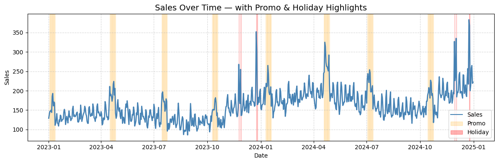
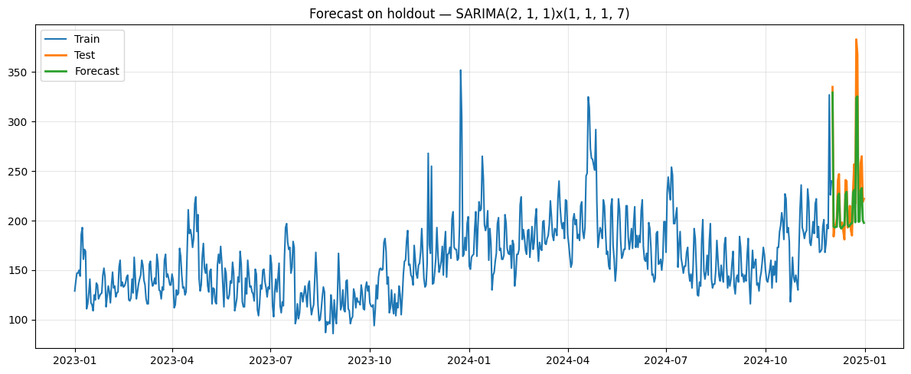

# Retail Sales Forecasting with Seasonal ARIMA (SARIMA)

This project demonstrates an end-to-end approach to forecasting **daily retail sales**.  
I start from a raw CSV, explore weekly seasonality and event effects (promotions & holidays), benchmark simple baselines, and deliver a **30-day forecast** with 95% confidence intervals.

---

## 1. Overview

Goals:
- Prepare a clean daily time series (indexing, frequency, missing values).
- Visualize history and highlight **promo/holiday** days.
- Establish **Naive** and **Seasonal-Naive** baselines.
- Train and evaluate a **Seasonal ARIMA (SARIMA)** model on a time holdout.
- Refit on all data and export a 30-day forecast with confidence intervals.

Outputs (in `graphs/`):
- `sales_history.png` — historical plot  
- `SARIMA.png` — holdout forecast (Train/Test/Forecast)  
- `SARIMA(30days).png` — 30-day forward forecast  
- `forecast_30d.csv` — forecast with lower/upper bounds

---

## 2. Project Setup

### Requirements
- Python 3.x  
- Jupyter Notebook or VS Code

### Installation
```bash
    git clone https://github.com/arsdmm/Time-Series-Analysis.git
    cd Time-Series-Analysis
    pip install -r requirements.txt
    jupyter notebook
```

### Required Libraries
```
    pandas==2.2.2
    numpy==1.26.4
    matplotlib==3.9.0
    statsmodels==0.14.0
    scikit-learn==1.4.0
```
---

## 3. Data Preparation

The dataset is **daily** with optional event flags.

### File: `data/sales.csv`

**Columns:**
- `date` — calendar date (timestamp)  
- `sales` — target variable (numeric)  
- `promo` — promotion flag (0/1)  
- `is_holiday` — holiday flag (0/1)

**Cleaning steps:**
- Removed duplicates (`drop_duplicates()`) if needed  
- Parsed dates and set `date` as the index  
- Sorted chronologically and enforced daily frequency with `asfreq('D')`  
- Filled occasional gaps in `sales` with time interpolation  
- Cast event flags to integers (0/1)

**Example:**
```python
    import pandas as pd

    sls = pd.read_csv("data/sales.csv", parse_dates=["date"])
    sls.set_index("date", inplace=True)
    sls = sls.sort_index().asfreq("D")

    # Fill target gaps if any
    if sls["sales"].isna().sum() > 0:
        sls["sales"] = sls["sales"].interpolate("time")

    use_exog = {"promo","is_holiday"}.issubset(sls.columns)
    exog = sls[["promo","is_holiday"]].astype(int) if use_exog else None
```
---

## 4. Modeling & Evaluation

### 4.1 Train/Test Split & Baselines

Holdout window: **last 30 days** (`h = 30`).

Baselines:
- **Naive** — “tomorrow = today”
- **Seasonal-Naive** — “same weekday last week” (weekly `m = 7`)

```python
    from sklearn.metrics import mean_absolute_error, mean_squared_error

    y = sls["sales"]
    h = 30
    train, test = y.iloc[:-h], y.iloc[-h:]

    train_x = exog.iloc[:-h] if use_exog else None
    test_x  = exog.iloc[-h:]  if use_exog else None

    # Baseline 1: Naive
    naive_pred = pd.Series(train.iloc[-1], index=test.index)
    naive_rmse = mean_squared_error(test, naive_pred) ** 0.5
    naive_mae  = mean_absolute_error(test, naive_pred)

    # Baseline 2: Seasonal-Naive (weekly)
    m = 7
    seasonal_naive = y.shift(m).iloc[-h:]
    sn_rmse = mean_squared_error(test, seasonal_naive) ** 0.5
    sn_mae  = mean_absolute_error(test, seasonal_naive)

    print(f"Naive           RMSE/MAE: {naive_rmse:.2f} / {naive_mae:.2f}")
    print(f"Seasonal-Naive  RMSE/MAE: {sn_rmse:.2f} / {sn_mae:.2f}")
```

### 4.2 Seasonal ARIMA (SARIMA)

Selected model: **SARIMA(2,1,1) × (1,1,1,7)**  
Rationale: (p,d,q) guided by ACF/PACF; (P,D,Q,m) captures weekly seasonality.

```python
    from statsmodels.tsa.statespace.sarimax import SARIMAX
    import numpy as np

    order = (2,1,1)
    seasonal_order = (1,1,1,7)

    model = SARIMAX(
        train,
        order=order,
        seasonal_order=seasonal_order,
        exog=train_x,
        enforce_stationarity=False,
        enforce_invertibility=False
    )
    res = model.fit(disp=False)

    # Forecast on the holdout
    fc = res.get_forecast(steps=h, exog=test_x)
    yhat = fc.predicted_mean

    rmse = mean_squared_error(test, yhat) ** 0.5
    mae  = mean_absolute_error(test, yhat)
    mape = (np.abs((test - yhat) / np.clip(test, 1e-9, None))).mean() * 100

    print(f"SARIMA{order}x{seasonal_order}  RMSE/MAE/MAPE: {rmse:.2f} / {mae:.2f} / {mape:.1f}%")
```

**Example outcomes (one run):**
- **ARIMA(2,1,1)** — RMSE ≈ **29.95**, MAE ≈ **22.19**  
- **SARIMA(2,1,1) × (1,1,1,7)** — RMSE ≈ **19.46**, MAE ≈ **14.61**, MAPE ≈ **5.9%**

> Results may vary slightly across time windows; see the notebook for live metrics.

---

## 5. Visualizations

### 5.1 Sales History
Shows the overall trajectory; promotions/holidays produce visible spikes.



### 5.2 Holdout Forecast (Train / Test / Forecast)
Compares predicted vs. actuals for the last 30 days.



### 5.3 Forward Forecast (30 Days)
Refit on all data and forecast ahead with 95% CI.

.png)

**Export:** `graphs/forecast_30d.csv`

---

## 6. Key Insights

- **Baselines first:** A forecast is only meaningful if it beats Seasonal-Naive.  
- **Seasonality is structural:** Weekly cycles required seasonal differencing + seasonal AR/MA; otherwise forecasts were too smooth.  
- **Event flags (promo/holiday):** help explain spikes but **don’t replace** explicit seasonality.  
- A compact, reproducible pipeline (time split → baselines → SARIMA → forecast) keeps analysis clear and actionable.

---

## 7. Learnings

Through this work I practiced:
- Time-series preparation (indexing, frequency, interpolation)
- Interpreting ACF/PACF for ARIMA orders
- Building/validating **SARIMA** vs. simple baselines
- Communicating results with clean plots and exported artifacts

---

## 8. Repository Structure

    .
    ├── data/
    │   └── sales.csv
    ├── graphs/
    │   ├── sales_history.png
    │   ├── SARIMA.png
    │   ├── SARIMA(30days).png
    │   └── forecast_30d.csv
    ├── notebooks/
    │   └── analysis.ipynb
    └── README.md

---

## 9. How to Reproduce

1. Open `notebooks/analysis.ipynb`.  
2. Run cells top-to-bottom:
   - Load & prepare data  
   - Plot history  
   - Compute Naive & Seasonal-Naive baselines  
   - Train **SARIMA(2,1,1) × (1,1,1,7)** and evaluate on a 30-day holdout  
   - Refit on all data and export `graphs/forecast_30d.csv`

---

## Author

**Dmytro Litvinov**  
LinkedIn: [Dmytro Litvinov](https://www.linkedin.com/in/dmytro-litvinov-2b319b235)

---

## License

This project is released under the MIT License.  
You are free to use, modify, and distribute it with attribution.
